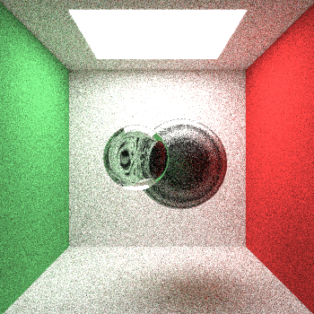

# Ray-Tracer: 3D Renderer

      
      
      
      
    

<h2> Description </h2>
A sophisticated ray tracing engine designed to simulate light propagation and produce realistic images by tracing rays of light as they interact with virtual objects. This engine was developed in C++ and harnesses multi-threading capabilities to optimize performance.

<h2> Features </h2>
Realistic Rendering: Employs advanced algorithms to simulate shadows, reflections, and refractions.
Configurable Scene Description: Define scene parameters including lights, objects, materials, and camera setups.
Image Output: Generates high-resolution images with customizable quality settings.

<h2> Set up and Installation </h2>

- Clone the Repository
- Navigate to the Directory: src
- Compile the Source: g++ -std=c++11 -o raytracer main.cpp
- Run the Program: ./raytracer

- Currently, changes to scene and quality need to be manually changed in the main file, further iterations will change this

<h2> Acknowledgements </h2>
- Peter Shirley's "Ray Tracing" Series: This project is heavily influenced by the concepts and techniques presented in Peter Shirley's book series on ray tracing. It served as a foundational resource for understanding and implementing core features of the ray tracer.
